```{r setup, include=FALSE}
library(here)
library(knitr)
library(kableExtra)

# Copied & modified from: https://github.com/gadenbuie/gentle-ggplot2 (Index.Rmd)
#
# Thanks to Garrick Aden-Buie (https://www.garrickadenbuie.com/) for sharing :)
#

knitr::opts_chunk$set(fig.width=4.4, fig.height=3.2, fig.retina=4,
                      out.width = "100%",
                      message=FALSE, warning=FALSE, cache = FALSE, 
                      autodep = TRUE, hiline=TRUE)

knitr::opts_hooks$set(fig.callout = function(options) {
  if (options$fig.callout) {
    options$echo <- FALSE
    options$out.height <- "99%"
    options$fig.width <- 16
    options$fig.height <- 8
  }
  options
})

options(
  htmltools.dir.version = FALSE, 
  width = 90,
  # max.print = 9999,
  knitr.table.format = "html"
)

```

class: middle, center

<div class="rlogo-left-top"></div> 
<div class="Rmarkdown-hex-right-top"></div> 

&nbsp;

<br>

# Introduction to R Markdown

<br>

### Saghir Bashir<br><br>23rd September 2019

<br>

https://github.com/saghirb/Rmarkdown-Intro-Workshop

---
class: inverse, middle, center

# Relax

# Experiment

# Make Mistakes

# Learn

# Enjoy

---
class: middle, center

<div class="rlogo-left-top"></div> 
<div class="Rmarkdown-hex-right-top"></div> 

# Outline

## R Markdown Examples

## What is R Markdown?

## HTML & PDF Documents

## Pretty Tables

## Summary

---
class: inverse
<div class="rlogo-right-top"></div> 

# Prerequisites

## Latest versions of: 

### &nbsp;&nbsp;&nbsp; 1. R: https://cran.r-project.org

### &nbsp;&nbsp;&nbsp; 2. RStudio: https://www.rstudio.com/products/rstudio

---
class: inverse, center, middle

<div class="Rmarkdown-hex-right-top"></div> 

# R Markdown Examples

---
class: center
<div class="Rmarkdown-hex-right-top"></div> 

# HTML "Analysis" Document

```{r eg-HTML-01, echo=FALSE, out.width="80%"}
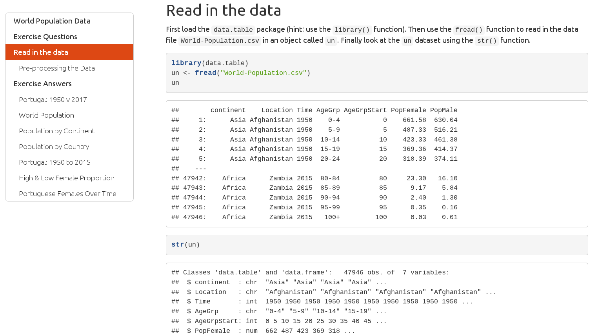
```

---
class: center
<div class="Rmarkdown-hex-right-top"></div> 
<div class="blogdown-left-top"></div> 

# HTML Website

```{r eg-HTML-02, echo=FALSE, out.width="80%"}
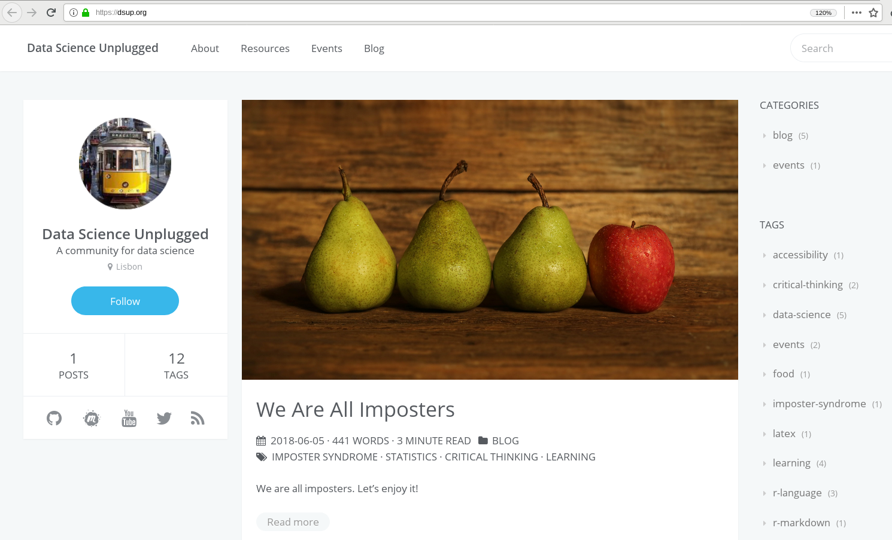
```

---
class: center
<div class="Rmarkdown-hex-right-top"></div> 
<div class="bookdown-left-top"></div> 

# HTML Book

```{r eg-HTML-03, echo=FALSE, out.width="80%"}
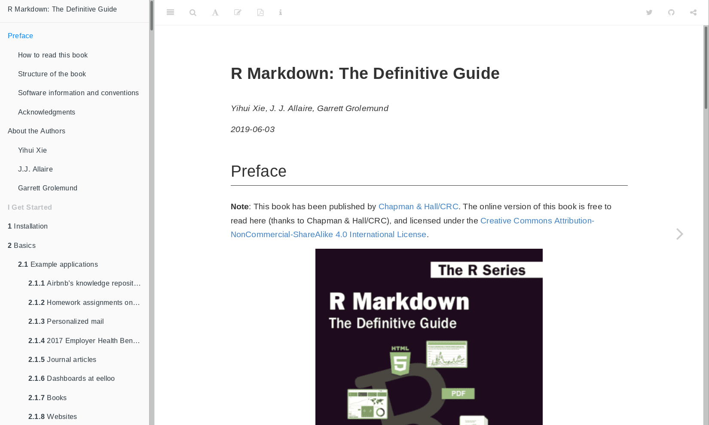
```

---
class: center
<div class="Rmarkdown-hex-right-top"></div> 

# PDF Article

```{r eg-PDF-01, echo=FALSE, out.width="70%"}
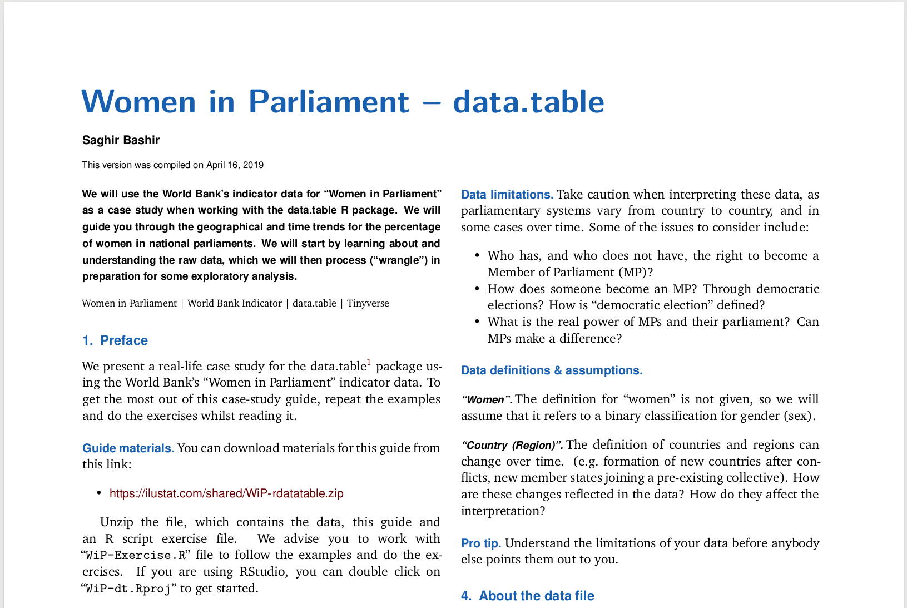
```

---
class: center
<div class="Rmarkdown-hex-right-top"></div> 
<div class="bookdown-left-top"></div> 

# PDF Book

```{r eg-PDF-02, echo=FALSE, out.width="70%"}
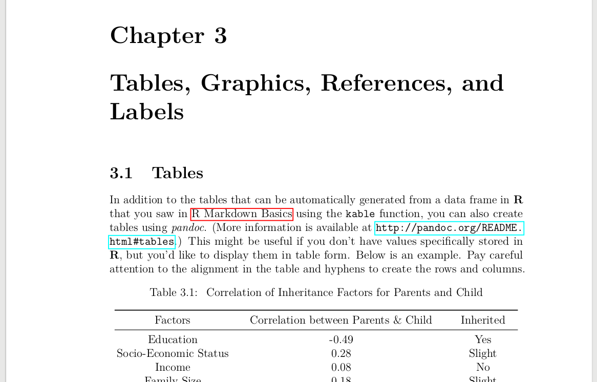
```

---
class: center
<div class="Rmarkdown-hex-right-top"></div> 

# PDF Presentation

```{r eg-PDF-03, echo=FALSE, out.width="65%"}
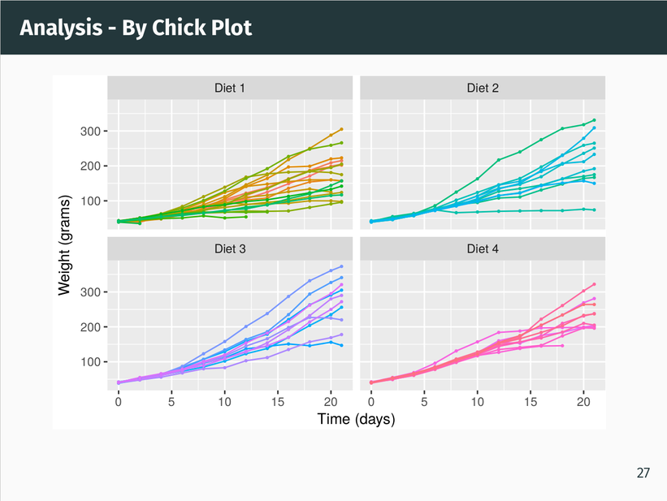
```

---
class: center
<div class="Rmarkdown-hex-right-top"></div> 
<div class="xaringan-hex-left-top"></div> 

# HTML Presentation

```{r eg-HTML-04, echo=FALSE, out.width="80%"}
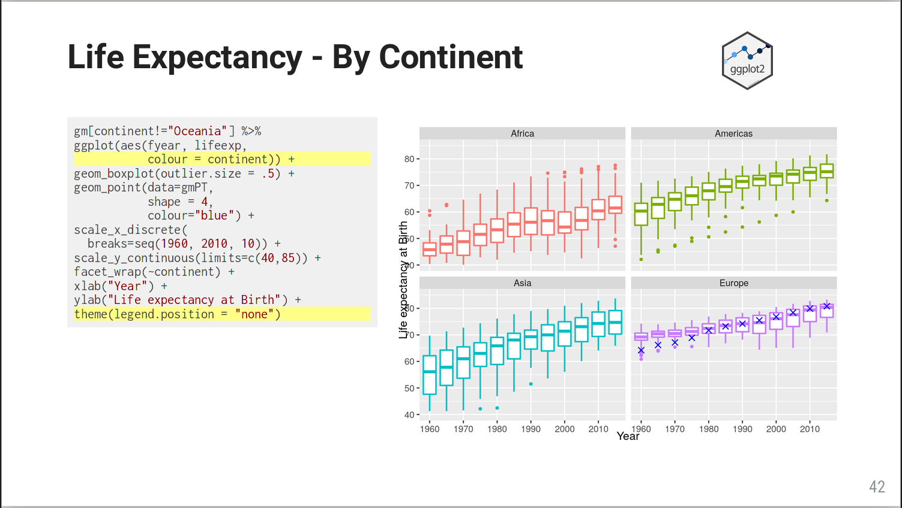
```

---
<div class="Rmarkdown-hex-right-top"></div> 

.center[# More R Markdown]

.pull-left[
## Formats

### &nbsp;&nbsp;&nbsp; - HTML

### &nbsp;&nbsp;&nbsp; - PDF

### &nbsp;&nbsp;&nbsp; - Word & ODF 

### &nbsp;&nbsp;&nbsp; - Power Point & ODF
]

.pull-right[
## Other

### &nbsp;&nbsp;&nbsp; - Dashboards

### &nbsp;&nbsp;&nbsp; - Web Applications

### &nbsp;&nbsp;&nbsp; - HTML Notebooks

### &nbsp;&nbsp;&nbsp; - CVs
]

---
class: inverse, center, middle

<div class="Rmarkdown-hex-right-top"></div> 

# What is R Markdown?

---
<div class="Rmarkdown-hex-right-top"></div> 

.center[# What is Markdown?]

<br>

## Special computer language ("Markup")

### &nbsp;&nbsp;&nbsp; - Plain text file with special syntax.

### &nbsp;&nbsp;&nbsp; - Human readable.

### &nbsp;&nbsp;&nbsp; - "Tags" define Structure & elements.

### &nbsp;&nbsp;&nbsp; - Converts to HTML, PDF, ...

---
<div class="Rmarkdown-hex-right-top"></div> 

.center[# Markdown Example]

.pull-left[
```
# Markdown Example

Paragraphs are separated by a blank line.

## Format text

Some _italic_, **bold** and `monospace` text.

Bullet list
+ Apples.
+ Oranges.
+ Pears

An [example link](https://github.com/saghirb)..
```
]
--
.pull-right[
### Markdown Example

Paragraphs are separated by a blank line.

#### Format text

Some _italic_, **bold** and `monospace` text.

Bullet list
+ Apples.
+ Oranges.
+ Pears

An [example link](https://github.com/saghirb).
]


---
<div class="Rmarkdown-hex-right-top"></div> 

.center[# What is R Markdown?]

<br>

## A mix of R programming and markdown.

### &nbsp;&nbsp;&nbsp; - R code and documentation in one place.

### &nbsp;&nbsp;&nbsp; - Great for doing reproducible research.

### &nbsp;&nbsp;&nbsp; - Great for collaborating and sharing.

### &nbsp;&nbsp;&nbsp; - Converts to HTML, PDF, websites, article, books, ...


---
<div class="Rmarkdown-hex-right-top"></div> 

.center[# R Markdown Example]

.pull-left[
```{r comment=NA, echo=FALSE}
cat('--- 
title: "R Markdown Demo"
author: "Saghir Bashir"
date: "13/06/2019"
output: html_document
---\n\n_Using_  **R** as a calculator.\n\n```{r Rcalc}
2+5
8**2\n```
\nPlot the `ChickWeight` data.\n```{r plotCW, echo=FALSE, out.width="80%"}
with(ChickWeight, boxplot(weight ~ Time))\n```')
```

]
--
.pull-right[
_Using_  **R** as a calculator.

```{r Rcalc}
(2+5)**2
```

Plot the `ChickWeight` data.

```{r plotCW, echo=FALSE, out.width="80%"}
with(ChickWeight, boxplot(weight ~ Time))
```
]

---
<div class="Rmarkdown-hex-right-top"></div> 

.center[# R Markdown Explained - YAML]

.pull-left[
```{r comment=NA, echo=FALSE, highlight.output=c(1:6)}
cat('--- 
title: "R Markdown Demo"
author: "Saghir Bashir"
date: "13/06/2019"
output: html_document
---\n\n_Using_  **R** as a calculator.\n\n```{r Rcalc}
2+5
8**2\n```
\nPlot the `ChickWeight` data.\n\n```{r plotCW, echo=FALSE, out.width="80%"}
with(ChickWeight, boxplot(weight ~ Time))\n```')
```
]

.pull-right[
## File extension is `.Rmd`

### &nbsp;&nbsp;&nbsp; - e.g. `My-Report.Rmd`

## Top is YAML header

### &nbsp;&nbsp;&nbsp; - Descriptive information.

### &nbsp;&nbsp;&nbsp; - Format & Style.
]

---
<div class="Rmarkdown-hex-right-top"></div> 

.center[# R Markdown Explained - Markdown]

.pull-left[
```{r comment=NA, echo=FALSE, highlight.output=c(8, 15)}
cat('--- 
title: "R Markdown Demo"
author: "Saghir Bashir"
date: "13/06/2019"
output: html_document
---\n\n_Using_  **R** as a calculator.\n\n```{r Rcalc}
2+5
8**2\n```
\nPlot the `ChickWeight` data.\n\n```{r plotCW, echo=FALSE, out.width="80%"}
with(ChickWeight, boxplot(weight ~ Time))\n```\n')
```
]

.pull-right[
## Below the YAML header

### - Markdown code.

]

---
<div class="Rmarkdown-hex-right-top"></div> 

.center[# R Markdown Explained - R Chunks]

.pull-left[
```{r comment=NA, echo=FALSE, highlight.output=c(10:13, 17, 18)}
cat('--- 
title: "R Markdown Demo"
author: "Saghir Bashir"
date: "13/06/2019"
output: html_document
---\n\n_Using_  **R** as a calculator.\n\n```{r Rcalc}
2+5
8**2\n```\n\nPlot the `ChickWeight` data.\n\n```{r plotCW, echo=FALSE, out.width="80%"}
with(ChickWeight, boxplot(weight ~ Time))\n```\n')
```
]

.pull-right[
## Below the YAML header

### - Markdown code.

### - R code chunks with:

### &nbsp;&nbsp;&nbsp; - unique names.

### &nbsp;&nbsp;&nbsp; - chunk options.
]


---
class: inverse, center, middle

<div class="Rmarkdown-hex-right-top"></div> 

# HTML Document

---
class: inverse, center, middle

<div class="Rmarkdown-hex-right-top"></div> 

## install.packages("kableExtra")

## install.packages("rticles")

## install.packages("tinytex")

## tinytex::install_tinytex()

---
class: center
<div class="Rmarkdown-hex-right-top"></div>

# Create a New RStudio Project

.left-plot[
```{r 01-Rmarkdown, echo=FALSE, out.width="90%"}
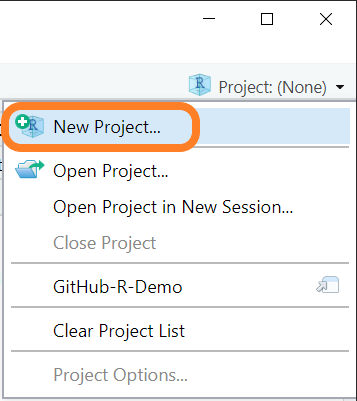
```
]
.right-plot[
```{r 02-Rmarkdown, echo=FALSE, out.width="90%"}
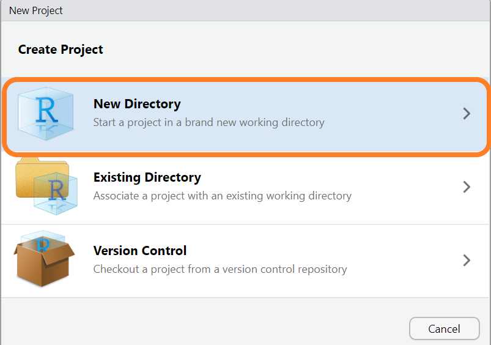
```
]

---
class: center
<div class="Rmarkdown-hex-right-top"></div>

# Select "New Project"

```{r 03-Rmarkdown, echo=FALSE, out.width="70%"}
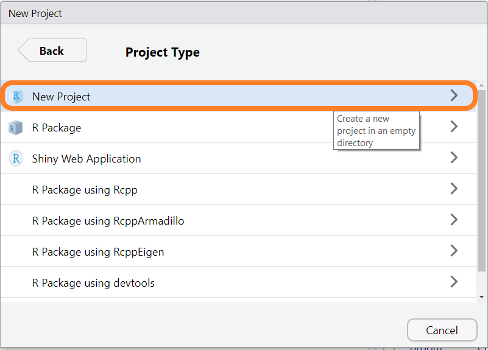
```

---
class: center
<div class="Rmarkdown-hex-right-top"></div>

# Define Directory Location

```{r 05-Rmarkdown, echo=FALSE, out.width="70%"}
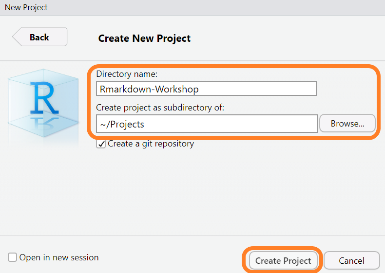
```

---
class: center
<div class="Rmarkdown-hex-right-top"></div>

# New Project Created

```{r 06-Rmarkdown, echo=FALSE, out.width="47%"}
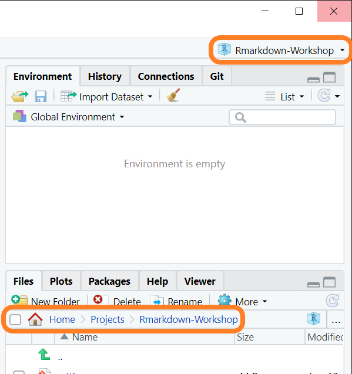
```

---
class: center
<div class="Rmarkdown-hex-right-top"></div>

# Create R Markdown Document

.left-plot[
```{r 07-Rmarkdown, echo=FALSE, out.width="100%"}
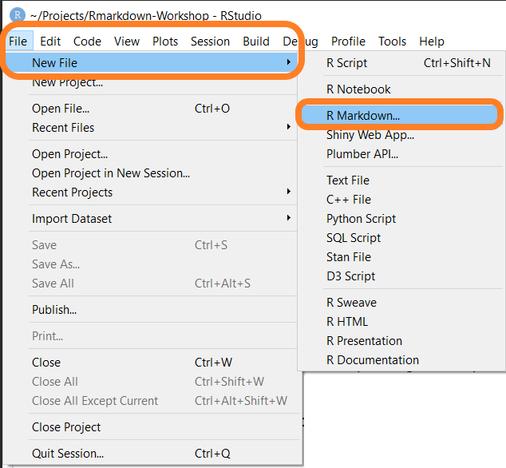
```
]
.right-plot[
```{r 08-Rmarkdown, echo=FALSE, out.width="75%"}
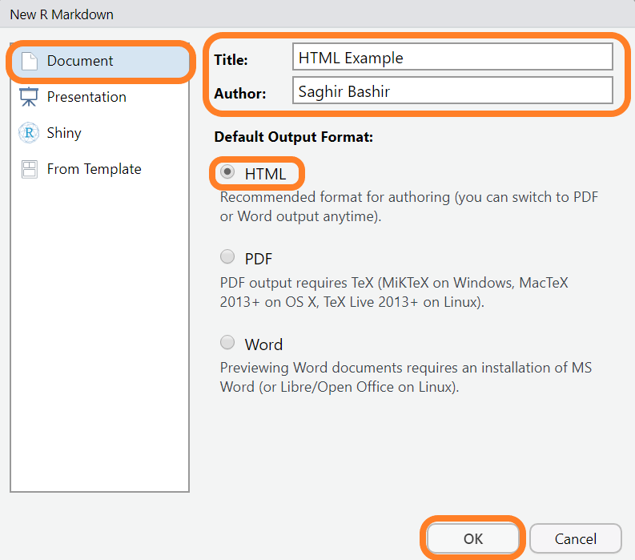
```
]

---
class: center
<div class="Rmarkdown-hex-right-top"></div>

# Untitled and Unsaved 

```{r 09-Rmarkdown, echo=FALSE, out.width="70%"}
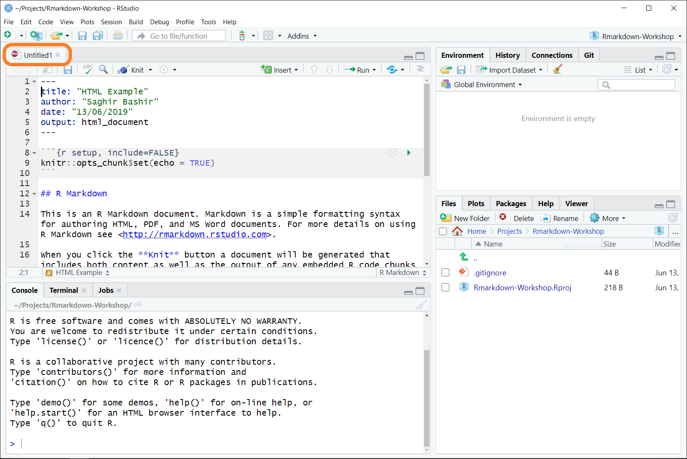
```

---
class: center
<div class="Rmarkdown-hex-right-top"></div>

# Save as .Rmd

```{r 10-Rmarkdown, echo=FALSE, out.width="60%"}
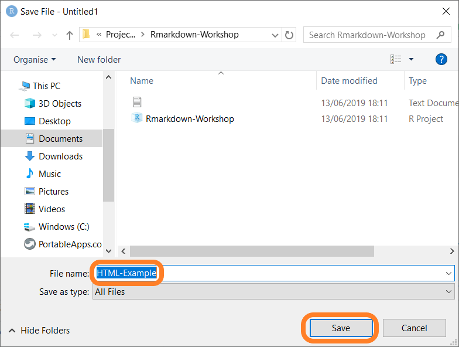
```

---
class: center
<div class="Rmarkdown-hex-right-top"></div>

# Click "Knit" to Create HTML File 

```{r 11-Rmarkdown, echo=FALSE, out.width="70%"}
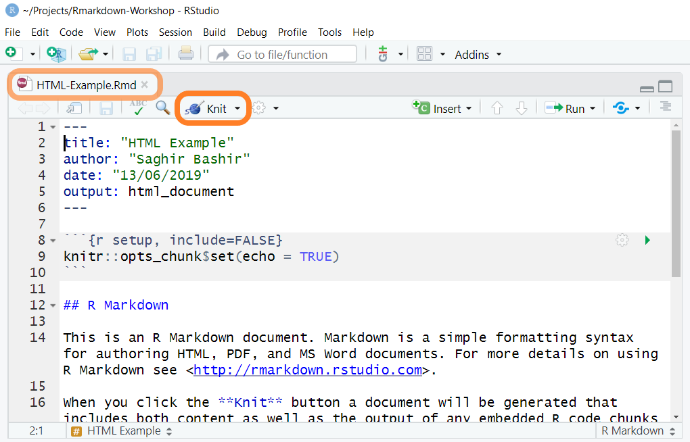
```

---
class: center
<div class="Rmarkdown-hex-right-top"></div>

# HTML Document - Top

```{r 12-Rmarkdown, echo=FALSE, out.width="60%"}
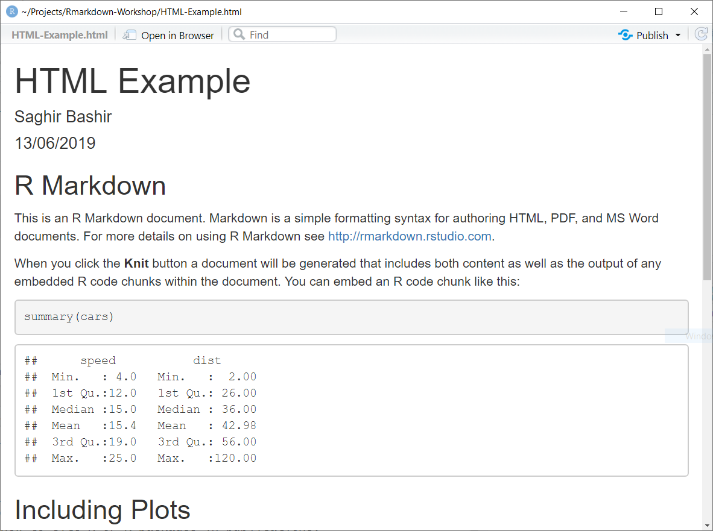
```

---
class: center
<div class="Rmarkdown-hex-right-top"></div>

# HTML Document - Bottom

```{r 13-Rmarkdown, echo=FALSE, out.width="60%"}
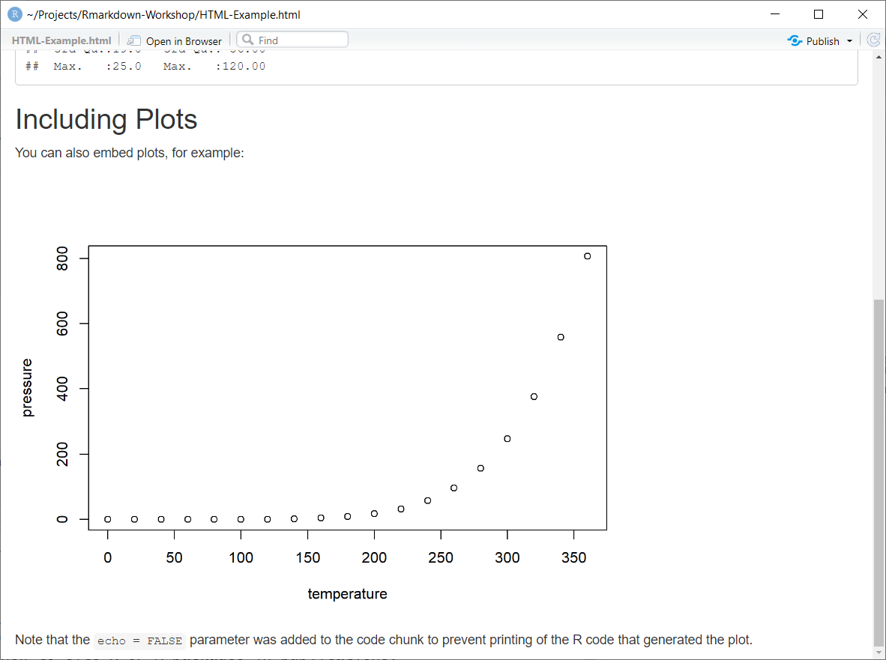
```

---
class: center
<div class="Rmarkdown-hex-right-top"></div>

# You Can "Knit" to PDF

```{r 14-Rmarkdown, echo=FALSE, out.width="70%"}
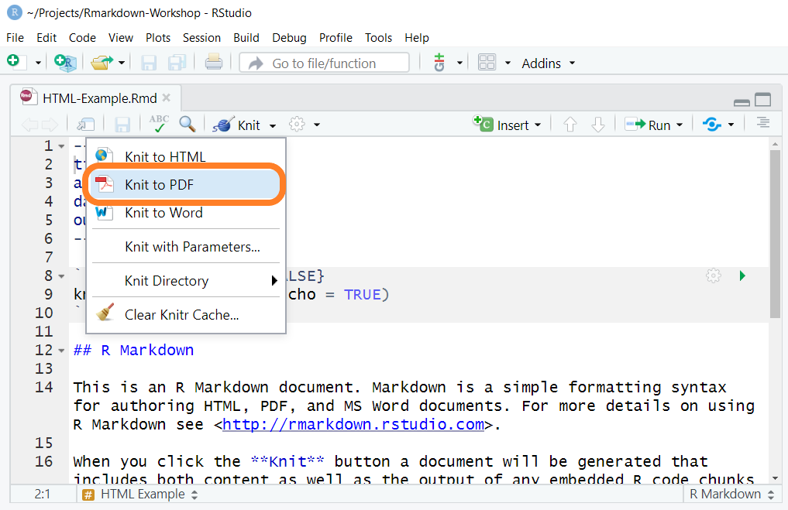
```

---
class: center
<div class="Rmarkdown-hex-right-top"></div>

# PDF Document

```{r 15-Rmarkdown, echo=FALSE, out.width="80%"}
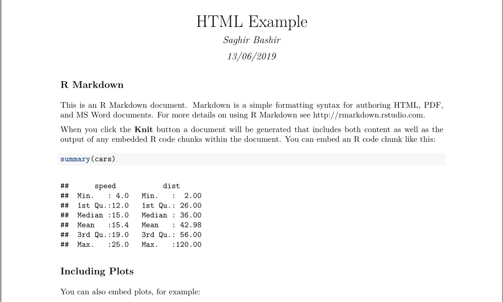
```

---
class: center
<div class="Rmarkdown-hex-right-top"></div>

# Change Theme & Style

```{r 16-Rmarkdown, echo=FALSE, out.width="90%"}
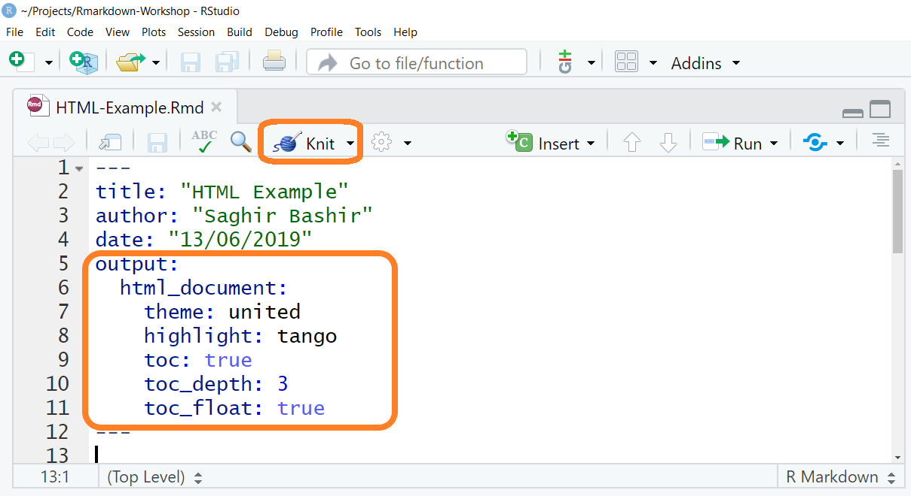
```

---
class: center
<div class="Rmarkdown-hex-right-top"></div>

# Updated Theme 

```{r 17-Rmarkdown, echo=FALSE, out.width="70%"}
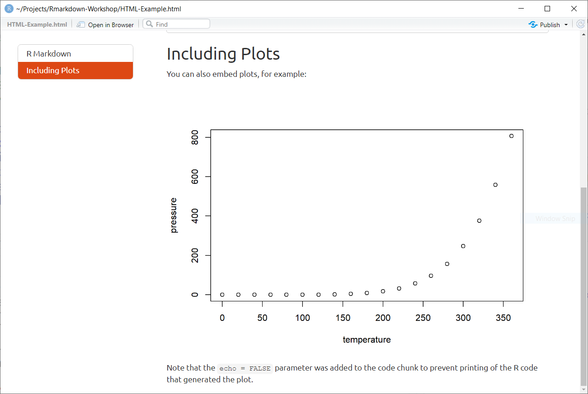
```

---
class: inverse

<div class="Rmarkdown-hex-right-top"></div> 

# R Markdown Cheatsheet

.left-plot[
```{r RmdCheatSheet, echo=FALSE, out.width="90%"}
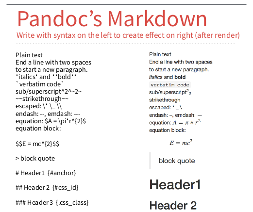
```
]
.right-plot[
### - Useful to find R markdown "tags".

### - Use it for the exercises.

### - Lots of other useful information too.

<br><br>

**Source: https://www.rstudio.com/resources/cheatsheets/**
]

---
class: inverse, middle, center

<div class="knitr-hex-right-top"></div> 

# Pretty Tables

---
<div class="knitr-hex-right-top"></div> 

# Objective

.pull-left[
```{r dummyData, echo=FALSE}
library(data.table)
sData <- fread("
Placebo, Baseline, 182, 27.4, 3.23
Placebo, Final, 157, 25.6, 4.11
Active, Baseline, 179, 26.7, 3.45
Active, Final, 145, 20.7, 4.27
", 
col.names = c("Treatment", "Visit", "N", "Mean", "S.D.")
)
```
## Before
```{r before}
sData
```

]
.pull-right[
# After
```{r after, echo = FALSE}
library(magrittr)
library(knitr)
library(kableExtra)
sData %>% 
  kable(align="lcrrr", digits=c(0, 0, 0, 1, 2))  %>% 
  kable_styling(bootstrap_options="striped", font_size = 24, full_width=TRUE) %>% 
  column_spec(1:5, width = "4em") %>% 
  collapse_rows(1, valign = "top")
```
]

---
<div class="knitr-hex-right-top"></div> 

# Use `knitr::kable`

.pull-left[
```{r before3}
library(magrittr) #<<
library(knitr) #<<
sData %>%  #<<
  kable()  #<<
```
]
.pull-right[
```{r after3, echo = TRUE}
library(magrittr)
library(knitr)
sData %>% 
 kable(align="lcrrr", digits=c(0, 0, 0, 1, 2)) #<<
```
]

---
<div class="knitr-hex-right-top"></div> 

# Use `kableExtra` Package

.pull-left[
```{r before4}
library(magrittr)
library(knitr)
library(kableExtra)
sData %>% 
 kable(align="lcrrr", digits=c(0, 0, 0, 1, 2))  %>% 
 kable_styling(bootstrap_options="striped",  #<<
               full_width=TRUE)  #<<
```
]
.pull-right[
```{r after4}
library(magrittr)
library(knitr)
library(kableExtra)
sData %>% 
 kable(align="lcrrr", digits=c(0, 0, 0, 1, 2))  %>% 
 kable_styling(bootstrap_options="striped", 
               full_width=TRUE) %>% 
 column_spec(1:5, width = "4em")  #<<
```
]

---
<div class="knitr-hex-right-top"></div> 

# Final Table

.pull-left[
```{r before5}
library(magrittr)
library(knitr)
library(kableExtra)
sData %>% 
 kable(align="lcrrr", digits=c(0, 0, 0, 1, 2))  %>% 
 kable_styling(bootstrap_options="striped", 
               full_width=TRUE) %>% 
 column_spec(1:5, width = "4em") %>% 
 collapse_rows(1, valign = "top")  #<<
```

]
.pull-right[
## We started with
```{r after5}
sData 
```
]

---
class: inverse

<div class="Rmarkdown-hex-right-top"></div> 

# Exercise (i)

<br> 

### &nbsp;&nbsp;&nbsp; 1) Download https://ilustat.com/shared/RmarkdownWS.zip

### &nbsp;&nbsp;&nbsp; 2) Unzip and double click "CW-Summary.Rproj" file.

### &nbsp;&nbsp;&nbsp; 3) Create a new Rmarkdown file called "CW-Report.Rmd" 

### &nbsp;&nbsp;&nbsp; 4) Recreate "CW-Report-Target.html"

---
class: inverse

<div class="Rmarkdown-hex-right-top"></div> 

# Exercise (ii)

<br> 

### Creating a HTML presention


### &nbsp;&nbsp;&nbsp; 1) Create a new "Presentation" from R Markdown.

### &nbsp;&nbsp;&nbsp; 2) Select "HTML (ioslides)" style.

### &nbsp;&nbsp;&nbsp; 3) Save as "CW-Slides.Rmd" 

### &nbsp;&nbsp;&nbsp; 4) Recreate "CW-Slides-Target.html"


---
class: inverse

<div class="Rmarkdown-hex-right-top"></div> 

# Summary

## R Markdown

### &nbsp;&nbsp;&nbsp; - R code and documentation in one place.

### &nbsp;&nbsp;&nbsp; - Great for doing reproducible research.

### &nbsp;&nbsp;&nbsp; - Great for collaborating and sharing.

### &nbsp;&nbsp;&nbsp; - A big range of possible outputs.

### &nbsp;&nbsp;&nbsp; - The rewards and benefits are big!

---
class: inverse

.center[
# Feedback
]

## Please send your feedback or comments via:

### &nbsp;&nbsp;&nbsp; - https://github.com/saghirb/Rmarkdown-Intro-Workshop or

### &nbsp;&nbsp;&nbsp; - https://twitter.com/ilustat

<br>

.right[
## Thanks!
]
---
class: inverse, center, middle

## This work is licensed under the

## Creative Commons Attribution-Non Commercial 4.0 International License.

## To view a copy of this license, visit

## http://creativecommons.org/licenses/by-nc/4.0/


